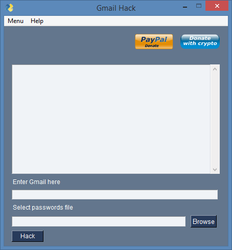

**Programmed in Python | PySimpleGUI**


[](https://www.python.org/)

[](https://github.com/adrijano/Gmail-Hack/)

[](https://github.com/adrijano/Gmail-Hack/graphs/commit-activity)


# Gmail Hack
```
Python script with PySimpleGUI for hack gmail account using brute force attack

```
# If you like it give it a star

[](https://github.com/adrijano/Gmail-Hack/)


[](https://www.paypal.com/donate/?cmd=_s-xclick&hosted_button_id=PFB6A6HLAQHC2&source=url)  [](https://commerce.coinbase.com/checkout/149a6235-ec7e-4d3b-a1ae-b08c4f08b4f6)


# Usage:
### Python3+

```
git clone https://github.com/adrijano/Gmail-Hack.git

cd Bitcoin-wallet-cracker && pip install -r requirements.txt

python gmail_hack.py

```
### Windows
```
cd dist
start gmail_hack.exe
```
## Donations
If you would like to support me, donations are very welcome.

```
You can use Paypal to donate using your own credit card. 
The payment is processed by PayPal but you don't need to have a
PayPal account or sign-up for one if you are paying by credit card.

You can also use your own Paypal account to donate.

You can also donate Bitcoin, Bitcoin Cash, Dai, Ethereum, Litecoin and USD Coin.
```
[](https://www.paypal.com/donate/?cmd=_s-xclick&hosted_button_id=PFB6A6HLAQHC2&source=url)  [](https://commerce.coinbase.com/checkout/149a6235-ec7e-4d3b-a1ae-b08c4f08b4f6)

[](https://github.com/adrijano/Gmail-Hack/)


# Disclaimer


**The code within this repository comes with no guarantee, the use of this code is your responsibility. I take NO responsibility and/or liability for how you choose to use any of the source code available here. By using any of the files available in this repository, you understand that you are AGREEING TO USE AT YOUR OWN RISK. Once again, ALL files available here are for EDUCATION and/or RESEARCH purposes ONLY.**


